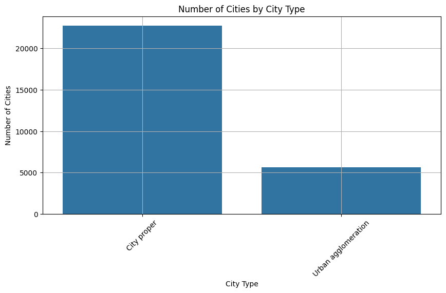
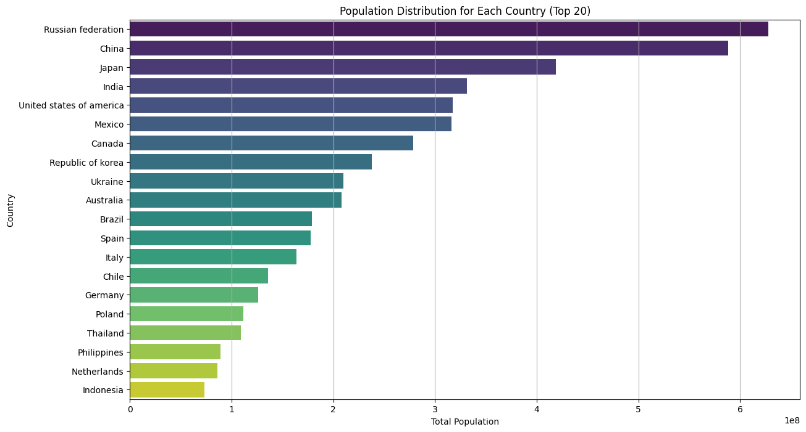
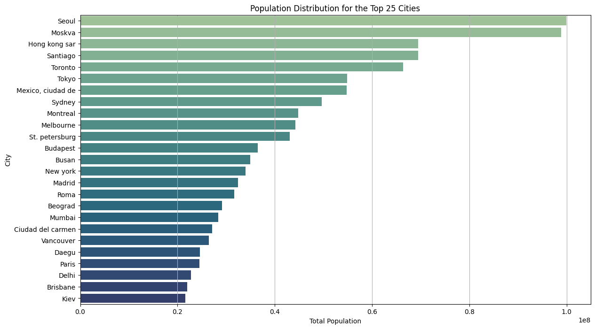

# City Population Annual Timeseries Analysis

## Project Description
This project aims to analyze the City Population Annual Timeseries dataset from the UN Statistics Division. The analysis includes data cleaning, exploratory data analysis (EDA), visualization, model development, and evaluation to gain insights into population trends across different cities.

## Dataset Description
The dataset contains annual population data for various cities worldwide, including the year of data collection, city type, country of origin, and population figures. 

## Summary of Findings
The analysis reveals significant trends in city populations over the years, highlighting the top cities by population and the distribution of population by city type and sex. The model evaluation indicates that the Decision Tree Regressor outperformed other models, achieving an R² Score of 98.54% and a Mean Absolute Error of 7.83.

## Data Preprocessing
The following data cleaning steps were taken:
- Removed unnecessary columns: 'Value Footnotes', 'Reliability', 'Record Type', 'Area', and 'Source Year'.
- Renamed columns for consistency.
- Cleared rows with missing values.
- Cleaned country names by removing special characters and text within parentheses.
- Converted population figures from string format to integers, eliminating decimals.

## Exploratory Data Analysis
### Visualization
1. **Population Distribution from 1972 to 2014**
   
   - Interpretation: The total population showed a steady increase from 1972 to 2014.

2. **Number of Cities by City Type**
   
   - Interpretation: The count of cities varies significantly across different city types.

3. **Total Population by Sex**
   
   - Interpretation: The distribution of the population is relatively balanced between sexes.

4. **Population Distribution for Each Country (Top 20)**
   
   - Interpretation: The population distribution highlights the largest countries by total population.

5. **Population Distribution for the Top 25 Cities**
   
   - Interpretation: The top cities by population show significant variations in their total populations.

## Model Development
The following models were developed and evaluated:
- Linear Regression
- Random Forest Regressor
- Decision Tree Regressor
- XGBoost Regressor

The models were trained on features such as 'City_Type', 'Year', 'Country_or_Area', and 'City'.

## Model Evaluation
| Model                       | Mean Absolute Error | R² Score   | Accuracy    |
|-----------------------------|---------------------|------------|-------------|
| Linear Regression           | 19.02               | 83.20%     | 80.98%      |
| Random Forest Regressor     | 9.57                | 95.61%     | 90.43%      |
| Decision Tree Regressor     | 7.83                | 98.54%     | 92.17%      |
| XGBoost Regressor           | 9.14                | 98.13%     | 90.86%      |

## Conclusion
The analysis successfully identified trends in city populations and evaluated several regression models. The Decision Tree Regressor demonstrated the best performance, making it a reliable model for predicting city populations based on available features.

## Contributors
NOTE: Your professor be the one to fill this section.
